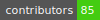
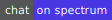
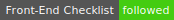
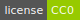
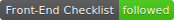
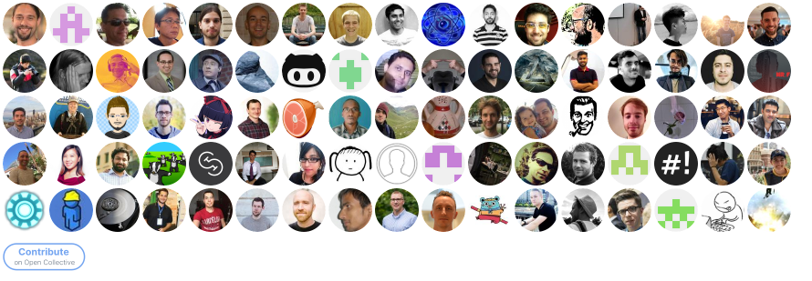

# Front-End-Checklist-html-page
Read " The perfect Front-End Checklist for modern websites and meticulous developers" in your browser.
I have made  one page containing the entire document.
All links will open in a new  tab or window  depending on your browser settings.
<!DOCTYPE html>
<html><head>
<meta http-equiv="content-type" content="text/html; charset=UTF-8">
        <title>The perfect Front-End Checklist for modern websites and meticulous developers</title>
        <meta charset="utf-8">
        <link rel="stylesheet" type="text/css" href="tocsrc/styles.css">
        
    <link rel="stylesheet" href="tocsrc/default.css"></head>
    <body>
        <article>
            <h1 align="center">
 
     
  Front-End Checklist
   
</h1>

<h4 align="center">The Front-End Checklist is an exhaustive list of all 
elements you need to have / to test before launching your website / HTML
 page to production.</h4>

  
    
  
      
    

  <a href="#how-to-use">How To Use</a> • <a href="#contributing">Contributing</a> • <a href="https://frontendchecklist.io/" target="_blank"> The  frontendchecklist.io Website</a> • <a href="https://www.producthunt.com/posts/front-end-checklist" target="_blank">Product Hunt</a>

    Other Checklists:
     
  <a href="https://github.com/thedaviddias/Front-End-Performance-Checklist#---------front-end-performance-checklist-" target="_blank">🎮 Front-End Performance Checklist</a> • <a href="https://github.com/thedaviddias/Front-End-Design-Checklist#front-end-design-checklist">💎 Front-End Design Checklist</a>

It is based on Front-End developers' years of experience, with the additions coming from some other open-source checklists.

<h2 id="table-of-contents">Table of Contents</h2>
<ol>
<li><strong><a href="#head">Head</a></strong></li><li><strong><a href="#html">HTML</a></strong></li><li><strong><a href="#webfonts">Webfonts</a></strong></li><li><strong><a href="#css">CSS</a></strong></li><li><strong><a href="#images">Images</a></strong></li><li><strong><a href="#javascript">JavaScript</a></strong></li><li><strong><a href="#security">Security</a></strong></li><li><strong><a href="#performance-1">Performance</a></strong></li><li><strong><a href="#accessibility">Accessibility</a></strong></li><li><strong><a href="#seo">SEO</a></strong></li><li><strong><a href="#translations">Translations</a></strong></li></ol>

<h2 id="how-to-use">How to use?</h2>

All items in the <strong>Front-End Checklist</strong> are required 
for the majority of the projects, but some elements can be omitted or 
are not essential (in the case of an administration web app, you may not
 need RSS feed for example). We choose to use 3 levels of flexibility:

<ul>
<li> means that the item is <strong>recommended</strong> but can be omitted in some particular situations.</li><li> means that the item is <strong>highly recommended</strong>
 and can eventually be omitted in some really particular cases. Some 
elements, if omitted, can have bad repercussions in terms of performance
 or SEO.</li><li> means that the item <strong>can't be omitted</strong>
 by any reason. You may cause a dysfunction in your page or have 
accessibility or SEO issues. The testing priority needs to be on these 
elements first.</li></ul>

Some resources possess an emoticon to help you understand which type of content / help you may find on the checklist:

<ul>
<li>📖: documentation or article</li><li>🛠: online tool / testing tool</li><li>📹: media or video content</li></ul>
<blockquote>

You can contribute to the <strong><em>Front-End Checklist App</em></strong> reading the <a href="https://github.com/thedaviddias/Front-End-Checklist/blob/master/README_APP.md" target="_blank">README_APP file</a> which explain everything about the project.

</blockquote>

<h2 id="head">Head</h2>
<blockquote>

<strong>Notes:</strong> You can find <a href="https://github.com/joshbuchea/HEAD" target="_blank">a list of everything</a> that could be found in the <code>&lt;head&gt;</code> of an HTML document.

</blockquote>
<h3 id="meta-tag">Meta tag</h3>
<ul>
<li class="task-list-item"><input class="task-list-item-checkbox" type="checkbox" disabled="disabled"> <strong>Doctype:</strong>  The Doctype is HTML5 and is at the top of all your HTML pages.</li></ul>
<pre><code class="lang-html hljs xml">&lt;!doctype html&gt; &lt;!-- HTML5 --&gt;
</code></pre>
<blockquote>
<ul>
<li>📖 <a href="https://www.w3.org/TR/html5/syntax.html#determining-the-character-encoding" target="_blank">Determining the character encoding - HTML5 W3C</a></li></ul>
</blockquote>

<em>The next 2 meta tags (Charset and Viewport) need to come first in the head.</em>

<ul>
<li class="task-list-item"><input class="task-list-item-checkbox" type="checkbox" disabled="disabled"> <strong>Charset:</strong>  The charset (UTF-8) is declared correctly.</li></ul>
<pre><code class="lang-html hljs xml">&lt;!-- Set character encoding for the document --&gt;
&lt;meta charset="utf-8"&gt;
</code></pre>
<ul>
<li class="task-list-item"><input class="task-list-item-checkbox" type="checkbox" disabled="disabled"> <strong>Viewport:</strong>  The viewport is declared correctly.</li></ul>
<pre><code class="lang-html hljs xml">&lt;!-- Viewport for responsive web design --&gt;
&lt;meta name="viewport" content="width=device-width, initial-scale=1, viewport-fit=cover"&gt;
</code></pre>
<ul>
<li class="task-list-item"><input class="task-list-item-checkbox" type="checkbox" disabled="disabled"> <strong>Title:</strong> 
 A title is used on all pages (SEO: Google calculates the pixel width of
 the characters used in the title, and it cuts off between 472 and 482 
pixels. The average character limit would be around 55-characters).</li></ul>
<pre><code class="lang-html hljs xml">&lt;!-- Document Title --&gt;
&lt;title&gt;Page Title less than 55 characters&lt;/title&gt;
</code></pre>
<blockquote>
<ul>
<li>📖 <a href="https://developer.mozilla.org/en-US/docs/Web/HTML/Element/title" target="_blank">Title - HTML - MDN</a></li><li>🛠 <a href="https://www.sistrix.com/serp-snippet-generator/" target="_blank">SERP Snippet Generator</a></li></ul>
</blockquote>
<ul>
<li class="task-list-item"><input class="task-list-item-checkbox" type="checkbox" disabled="disabled"> <strong>Description:</strong>  A meta description is provided, it is unique and doesn't possess more than 150 characters.</li></ul>
<pre><code class="lang-html hljs xml">&lt;!-- Meta Description --&gt;
&lt;meta name="description" content="Description of the page less than 150 characters"&gt;
</code></pre>
<blockquote>
<ul>
<li>📖 <a href="https://developer.mozilla.org/en-US/docs/Learn/HTML/Introduction_to_HTML/The_head_metadata_in_HTML#Adding_an_author_and_description" target="_blank">Meta Description - HTML - MDN</a></li></ul>
</blockquote>
<ul>
<li class="task-list-item"><input class="task-list-item-checkbox" type="checkbox" disabled="disabled"> <strong>Favicons:</strong>  Each favicon has been created and displays correctly. If you have only a <code>favicon.ico</code>,
 put it at the root of your site. Normally you won't need to use any 
markup. However, it's still good practice to link to it using the 
example below. Today, <strong>PNG format is recommended</strong> over <code>.ico</code> format (dimensions: 32x32px).</li></ul>
<pre><code class="lang-html hljs xml">&lt;!-- Standard favicon --&gt;
&lt;link rel="icon" type="image/x-icon" href="https://example.com/favicon.ico"&gt;
&lt;!-- Recommended favicon format --&gt;
&lt;link rel="icon" type="image/png" href="https://example.com/favicon.png"&gt;
</code></pre>
<blockquote>
<ul>
<li>🛠 <a href="https://www.favicon-generator.org/" target="_blank">Favicon Generator</a></li><li>🛠 <a href="https://realfavicongenerator.net/" target="_blank">RealFaviconGenerator</a></li><li>📖 <a href="https://github.com/audreyr/favicon-cheat-sheet" target="_blank">Favicon Cheat Sheet</a></li><li>📖 <a href="https://css-tricks.com/favicon-quiz/" target="_blank">Favicons, Touch Icons, Tile Icons, etc. Which Do You Need? - CSS Tricks</a></li><li>📖 <a href="https://caniuse.com/#feat=link-icon-png" target="_blank">PNG favicons - caniuse</a></li></ul>
</blockquote>
<ul>
<li class="task-list-item"><input class="task-list-item-checkbox" type="checkbox" disabled="disabled"> <strong>Apple Web App Meta:</strong>  Apple meta-tags are present.</li></ul>
<pre><code class="lang-html hljs xml">&lt;!-- Apple Touch Icon (at least 200x200px) --&gt;
&lt;link rel="apple-touch-icon" href="/custom-icon.png"&gt;

&lt;!-- To run web application in full-screen --&gt;
&lt;meta name="apple-mobile-web-app-capable" content="yes"&gt;

&lt;!-- Status Bar Style (see Supported Meta Tags below for available values) --&gt;
&lt;!-- Has no effect unless you have the previous meta tag --&gt;
&lt;meta name="apple-mobile-web-app-status-bar-style" content="black"&gt;
</code></pre>
<blockquote>
<ul>
<li>📖 <a href="https://developer.apple.com/library/content/documentation/AppleApplications/Reference/SafariWebContent/ConfiguringWebApplications/ConfiguringWebApplications.html" target="_blank">Configuring Web Applications</a></li><li>📖 <a href="https://developer.apple.com/library/content/documentation/AppleApplications/Reference/SafariHTMLRef/Articles/MetaTags.html" target="_blank">Supported Meta Tags</a></li></ul>
</blockquote>
<ul>
<li class="task-list-item"><input class="task-list-item-checkbox" type="checkbox" disabled="disabled"> <strong>Windows Tiles:</strong>  Windows tiles are present and linked.</li></ul>
<pre><code class="lang-html hljs xml">&lt;!-- Microsoft Tiles --&gt;
&lt;meta name="msapplication-config" content="browserconfig.xml" /&gt;
</code></pre>

Minimum required xml markup for the <code>browserconfig.xml</code> file is as follows:

<pre><code class="lang-xml hljs">&lt;?xml version="1.0" encoding="utf-8"?&gt;
&lt;browserconfig&gt;
   &lt;msapplication&gt;
     &lt;tile&gt;
        &lt;square70x70logo src="small.png"/&gt;
        &lt;square150x150logo src="medium.png"/&gt;
        &lt;wide310x150logo src="wide.png"/&gt;
        &lt;square310x310logo src="large.png"/&gt;
     &lt;/tile&gt;
   &lt;/msapplication&gt;
&lt;/browserconfig&gt;
</code></pre>
<blockquote>
<ul>
<li>📖 <a href="https://msdn.microsoft.com/en-us/library/dn320426(v=vs.85" target="_blank">Browser configuration schema reference</a>.aspx)</li></ul>
</blockquote>
<ul>
<li class="task-list-item"><input class="task-list-item-checkbox" type="checkbox" disabled="disabled"> <strong>Canonical:</strong>  Use <code>rel="canonical"</code> to avoid duplicate content.</li></ul>
<pre><code class="lang-html hljs xml">&lt;!-- Helps prevent duplicate content issues --&gt;
&lt;link rel="canonical" href="http://example.com/2017/09/a-new-article-to-read.html"&gt;
</code></pre>
<blockquote>
<ul>
<li>📖 <a href="https://support.google.com/webmasters/answer/139066?hl=en" target="_blank">Use canonical URLs - Search Console Help - Google Support</a></li><li>📖 <a href="https://webmasters.googleblog.com/2013/04/5-common-mistakes-with-relcanonical.html" target="_blank">5 common mistakes with rel=canonical - Google Webmaster Blog</a></li></ul>
</blockquote>
<h3 id="html-tags">HTML tags</h3>
<ul>
<li class="task-list-item"><input class="task-list-item-checkbox" type="checkbox" disabled="disabled"> <strong>Language attribute:</strong>  The <code>lang</code> attribute of your website is specified and related to the language of the current page.</li></ul>
<pre><code class="lang-html hljs xml">&lt;html lang="en"&gt;
</code></pre>
<ul>
<li class="task-list-item"><input class="task-list-item-checkbox" type="checkbox" disabled="disabled"> <strong>Direction attribute:</strong>  The direction of lecture is specified on the html tag (It can be used on another HTML tag).</li></ul>
<pre><code class="lang-html hljs xml">&lt;html dir="rtl"&gt;
</code></pre>
<blockquote>
<ul>
<li>📖 <a href="https://developer.mozilla.org/en-US/docs/Web/HTML/Global_attributes/dir" target="_blank">dir - HTML - MDN</a></li></ul>
</blockquote>
<ul>
<li class="task-list-item"><input class="task-list-item-checkbox" type="checkbox" disabled="disabled"> <strong>Alternate language:</strong>  The language tag of your website is specified and related to the language of the current page.</li></ul>
<pre><code class="lang-html hljs xml">&lt;link rel="alternate" href="https://es.example.com/" hreflang="es"&gt;
</code></pre>
<ul>
<li class="task-list-item"><input class="task-list-item-checkbox" type="checkbox" disabled="disabled"> <strong>Conditional comments:</strong>  Conditional comments are present for IE if needed.</li></ul>
<blockquote>
<ul>
<li>📖 <a href="https://msdn.microsoft.com/en-us/library/ms537512(v=vs.85" target="_blank">About conditional comments (Internet Explorer) - MSDN - Microsoft</a>.aspx)</li></ul>
</blockquote>
<ul>
<li>
[ ] <strong>RSS feed:</strong>  If your project is a blog or has articles, an RSS link was provided.

</li><li>
[ ] <strong>CSS Critical:</strong> 
 The CSS critical (or "above the fold") collects all the CSS used to 
render the visible portion of the page. It is embedded before your 
principal CSS call and between <code>&lt;style&gt;&lt;/style&gt;</code> in a single line (minified).

</li></ul>
<blockquote>
<ul>
<li>🛠 <a href="https://github.com/addyosmani/critical" target="_blank">Critical by Addy Osmani on GitHub</a> automates this.</li></ul>
</blockquote>
<ul>
<li class="task-list-item"><input class="task-list-item-checkbox" type="checkbox" disabled="disabled"> <strong>CSS order:</strong>  All CSS files are loaded before any JavaScript files in the <code>&lt;head&gt;</code>. (Except the case where sometimes JS files are loaded asynchronously on top of your page).</li></ul>
<h3 id="social-meta">Social meta</h3>

Visualize and generate automatically our social meta tags with <a href="https://metatags.io/" target="_blank">Meta Tags</a>

<strong><em>Facebook OG</em></strong> and <strong><em>Twitter Cards</em></strong>
 are, for any website, highly recommended. The other social media tags 
can be considered if you target a particular presence on those and want 
to ensure the display.

<ul>
<li class="task-list-item"><input class="task-list-item-checkbox" type="checkbox" disabled="disabled"> <strong>Facebook Open Graph:</strong> 
 All Facebook Open Graph (OG) are tested and no one is missing or with a
 false information. Images need to be at least 600 x 315 pixels, 
although 1200 x 630 pixels is recommended.</li></ul>
<blockquote>

<strong>Notes:</strong> Using <code>og:image:width</code> and <code>og:image:height</code>
 will specify the image dimensions to the crawler so that it can render 
the image immediately without having to asynchronously download and 
process it.

</blockquote>
<pre><code class="lang-html hljs xml">&lt;meta property="og:type" content="website"&gt;
&lt;meta property="og:url" content="https://example.com/page.html"&gt;
&lt;meta property="og:title" content="Content Title"&gt;
&lt;meta property="og:image" content="https://example.com/image.jpg"&gt;
&lt;meta property="og:description" content="Description Here"&gt;
&lt;meta property="og:site_name" content="Site Name"&gt;
&lt;meta property="og:locale" content="en_US"&gt;
&lt;!-- Next tags are optional but recommended --&gt;
&lt;meta property="og:image:width" content="1200"&gt;
&lt;meta property="og:image:height" content="630"&gt;
</code></pre>
<blockquote>
<ul>
<li>📖 <a href="https://developers.facebook.com/docs/sharing/webmasters/" target="_blank">A Guide to Sharing for Webmasters</a></li><li>📖 <a href="https://developers.facebook.com/docs/sharing/best-practices/" target="_blank">Best Practices - Sharing</a></li><li>🛠 Test your page with the <a href="https://developers.facebook.com/tools/debug/" target="_blank">Facebook OG testing</a></li></ul>
</blockquote>
<ul>
<li class="task-list-item"><input class="task-list-item-checkbox" type="checkbox" disabled="disabled"> <strong>Twitter Card:</strong> </li></ul>
<pre><code class="lang-html hljs xml">&lt;meta name="twitter:card" content="summary"&gt;
&lt;meta name="twitter:site" content="@site_account"&gt;
&lt;meta name="twitter:creator" content="@individual_account"&gt;
&lt;meta name="twitter:url" content="https://example.com/page.html"&gt;
&lt;meta name="twitter:title" content="Content Title"&gt;
&lt;meta name="twitter:description" content="Content description less than 200 characters"&gt;
&lt;meta name="twitter:image" content="https://example.com/image.jpg"&gt;
</code></pre>
<blockquote>
<ul>
<li>📖 <a href="https://developer.twitter.com/en/docs/tweets/optimize-with-cards/guides/getting-started" target="_blank">Getting started with cards — Twitter Developers</a></li><li>🛠 Test your page with the <a href="https://cards-dev.twitter.com/validator" target="_blank">Twitter card validator</a></li></ul>
</blockquote>

<strong><a href="#table-of-contents">⬆ back to top</a></strong>

<h2 id="html">HTML</h2>
<h3 id="best-practices">Best practices</h3>
<ul>
<li class="task-list-item"><input class="task-list-item-checkbox" type="checkbox" disabled="disabled"> <strong>HTML5 Semantic Elements:</strong>  HTML5 Semantic Elements are used appropriately (header, section, footer, main...).</li></ul>
<blockquote>
<ul>
<li>📖 <a href="http://htmlreference.io/" target="_blank">HTML Reference</a></li></ul>
</blockquote>
<ul>
<li>
[ ] <strong>Error pages:</strong> 
 Error 404 page and 5xx exist. Remember that the 5xx error pages need to
 have their CSS integrated (no external call on the current server).

</li><li>
[ ] <strong>Noopener:</strong>  In case you are using external links with <code>target="_blank"</code>, your link should have a <code>rel="noopener"</code> attribute to prevent tab nabbing. If you need to support older versions of Firefox, use <code>rel="noopener noreferrer"</code>.

</li></ul>
<blockquote>
<ul>
<li>📖 <a href="https://mathiasbynens.github.io/rel-noopener/" target="_blank">About rel=noopener</a></li></ul>
</blockquote>
<ul>
<li class="task-list-item"><input class="task-list-item-checkbox" type="checkbox" disabled="disabled"> <strong>Clean up comments:</strong>  Unnecessary code needs to be removed before sending the page to production.</li></ul>
<h3 id="html-testing">HTML testing</h3>
<ul>
<li class="task-list-item"><input class="task-list-item-checkbox" type="checkbox" disabled="disabled"> <strong>W3C compliant:</strong>  All pages need to be tested with the W3C validator to identify possible issues in the HTML code.</li></ul>
<blockquote>
<ul>
<li>🛠 <a href="https://validator.w3.org/" target="_blank">W3C validator</a></li></ul>
</blockquote>
<ul>
<li class="task-list-item"><input class="task-list-item-checkbox" type="checkbox" disabled="disabled"> <strong>HTML Lint:</strong>  I use tools to help me analyze any issues I could have on my HTML code.</li></ul>
<blockquote>
<ul>
<li>
🛠 <a href="https://dirtymarkup.com/" target="_blank">Dirty markup</a>

</li><li>
🛠 <a href="https://webhint.io/" target="_blank">webhint</a>

</li></ul>
</blockquote>
<ul>
<li class="task-list-item"><input class="task-list-item-checkbox" type="checkbox" disabled="disabled"> <strong>Link checker:</strong>  There are no broken links in my page, verify that you don't have any 404 error.</li></ul>
<blockquote>
<ul>
<li>🛠 <a href="https://validator.w3.org/checklink">W3C Link Checker</a></li></ul>
</blockquote>
<ul>
<li class="task-list-item"><input class="task-list-item-checkbox" type="checkbox" disabled="disabled"> <strong>Adblockers test:</strong> 
 Your website shows your content correctly with adblockers enabled (You 
can provide a message encouraging people to disable their adblocker).</li></ul>
<blockquote>
<ul>
<li>📖 <a href="https://andreicioara.com/use-adblocking-in-your-dev-environment-48db500d9b86" target="_blank">Use AdBlocking in your Dev Environment</a></li></ul>
</blockquote>

<strong><a href="#table-of-contents">⬆ back to top</a></strong>

<h2 id="webfonts">Webfonts</h2>
<blockquote>

<strong>Notes:</strong> Using webfonts may cause Flash Of Unstyled 
Text/Flash Of Invisible Text - consider having fallback fonts and/or 
utilizing webfont loaders to control behavior.

<ul>
<li>📖 <a href="https://developers.google.com/fonts/docs/technical_considerations" target="_blank">Google Technical considerations about webfonts</a></li></ul>
</blockquote>
<ul>
<li class="task-list-item"><input class="task-list-item-checkbox" type="checkbox" disabled="disabled"> <strong>Webfont format:</strong>  WOFF, WOFF2 and TTF are supported by all modern browsers.</li></ul>
<blockquote>
<ul>
<li>📖 <a href="https://caniuse.com/#feat=woff" target="_blank">WOFF - Web Open Font Format - Caniuse</a>.</li><li>📖 <a href="https://caniuse.com/#feat=woff2">WOFF 2.0 - Web Open Font Format - Caniuse</a>.</li><li>📖 <a href="https://caniuse.com/#feat=ttf">TTF/OTF - TrueType and OpenType font support</a></li><li>📖 <a href="https://css-tricks.com/snippets/css/using-font-face/" target="_blank">Using @font-face - CSS-Tricks</a></li></ul>
</blockquote>
<ul>
<li>
[ ] <strong>Webfont size:</strong>  Webfont sizes don't exceed 2 MB (all variants included).

</li><li>
[ ] <strong>Webfont loader:</strong>  Control loading behavior with a webfont loader

</li></ul>
<blockquote>
<ul>
<li>🛠 <a href="https://github.com/typekit/webfontloader" target="_blank">Typekit Web Font Loader</a></li></ul>
</blockquote>

<strong><a href="#table-of-contents">⬆ back to top</a></strong>

<h2 id="css">CSS</h2>
<blockquote>

<strong>Notes:</strong> Take a look at <a href="https://cssguidelin.es/" target="_blank">CSS guidelines</a> and <a href="https://sass-guidelin.es/" target="_blank">Sass Guidelines</a> followed by most  Front-End developers. If you have a doubt about CSS properties, you can visit <a href="http://cssreference.io/" target="_blank">CSS Reference</a>. There is also a short <a href="http://codeguide.co/" target="_blank">Code Guide</a> for consistency.

</blockquote>
<ul>
<li class="task-list-item"><input class="task-list-item-checkbox" type="checkbox" disabled="disabled"> <strong>Responsive Web Design:</strong>  The website is using responsive web design.</li><li class="task-list-item"><input class="task-list-item-checkbox" type="checkbox" disabled="disabled"> <strong>CSS Print:</strong>  A print stylesheet is provided and is correct on each page.</li><li class="task-list-item"><input class="task-list-item-checkbox" type="checkbox" disabled="disabled"> <strong>Preprocessors:</strong>  Your project is using a CSS preprocessor (e.g <a href="http://sass-lang.com/" target="_blank">Sass</a>, <a href="http://lesscss.org/" target="_blank">Less</a>, <a href="http://stylus-lang.com/">Stylus</a>).</li><li class="task-list-item"><input class="task-list-item-checkbox" type="checkbox" disabled="disabled"> <strong>Unique ID:</strong>  If IDs are used, they are unique to a page.</li><li class="task-list-item"><input class="task-list-item-checkbox" type="checkbox" disabled="disabled"> <strong>Reset CSS:</strong>  A CSS reset (reset, normalize or reboot) is used and up to date. <em>(If you are using a CSS Framework like Bootstrap or Foundation, a Normalize is already included into it.)</em></li></ul>
<blockquote>
<ul>
<li>📖 <a href="https://meyerweb.com/eric/tools/css/reset/" target="_blank">Reset.css</a></li><li>📖 <a href="https://necolas.github.io/normalize.css/" target="_blank">Normalize.css</a></li><li>📖 <a href="https://getbootstrap.com/docs/4.0/content/reboot/" target="_blank">Reboot</a></li></ul>
</blockquote>
<ul>
<li class="task-list-item"><input class="task-list-item-checkbox" type="checkbox" disabled="disabled"> <strong>JS prefix:</strong>  All classes (or id- used in JavaScript files) begin with <strong>js-</strong> and are not styled into the CSS files.</li></ul>
<pre><code class="lang-html hljs xml">&lt;div id="js-slider" class="my-slider"&gt;
&lt;!-- Or --&gt;
&lt;div id="id-used-by-cms" class="js-slider my-slider"&gt;
</code></pre>
<ul>
<li class="task-list-item"><input class="task-list-item-checkbox" type="checkbox" disabled="disabled"> <strong>embedded or inline CSS:</strong>  Avoid at all cost embedding CSS in <code>&lt;style&gt;</code> tags or using inline CSS: only use for valid reasons (e.g. background-image for slider, critical CSS).</li><li class="task-list-item"><input class="task-list-item-checkbox" type="checkbox" disabled="disabled"> <strong>Vendor prefixes:</strong>  CSS vendor prefixes are used and are generated accordingly with your browser support compatibility.</li></ul>
<blockquote>
<ul>
<li>🛠 <a href="https://autoprefixer.github.io/" target="_blank">Autoprefixer CSS online</a></li></ul>
</blockquote>
<h3 id="performance">Performance</h3>
<ul>
<li class="task-list-item"><input class="task-list-item-checkbox" type="checkbox" disabled="disabled"> <strong>Concatenation:</strong>  CSS files are concatenated in a single file <em>(Not for HTTP/2)</em>.</li><li class="task-list-item"><input class="task-list-item-checkbox" type="checkbox" disabled="disabled"> <strong>Minification:</strong>  All CSS files are minified.</li><li class="task-list-item"><input class="task-list-item-checkbox" type="checkbox" disabled="disabled"> <strong>Non-blocking:</strong>  CSS files need to be non-blocking to prevent the DOM from taking time to load.</li></ul>
<blockquote>
<ul>
<li>📖 <a href="https://github.com/filamentgroup/loadCSS" target="_blank">loadCSS by filament group</a></li><li>📖 <a href="https://gist.github.com/thedaviddias/c24763b82b9991e53928e66a0bafc9bf" target="_blank">Example of preload CSS using loadCSS</a></li></ul>
</blockquote>
<ul>
<li class="task-list-item"><input class="task-list-item-checkbox" type="checkbox" disabled="disabled"> <strong>Unused CSS:</strong>  Remove unused CSS.</li></ul>
<blockquote>
<ul>
<li>🛠 <a href="https://uncss-online.com/" target="_blank">UnCSS Online</a></li><li>🛠 <a href="https://github.com/purifycss/purifycss" target="_blank">PurifyCSS</a></li><li>🛠 <a href="https://github.com/FullHuman/purgecss" target="_blank">PurgeCSS</a></li><li>🛠 <a href="https://developers.google.com/web/updates/2017/04/devtools-release-notes#coverage" target="_blank">Chrome DevTools Coverage</a></li></ul>
</blockquote>
<h3 id="css-testing">CSS testing</h3>
<ul>
<li class="task-list-item"><input class="task-list-item-checkbox" type="checkbox" disabled="disabled"> <strong>Stylelint:</strong>  All CSS or SCSS files are without any errors.</li></ul>
<blockquote>
<ul>
<li>🛠 <a href="https://stylelint.io/" target="_blank">stylelint, a CSS linter</a></li><li>📖 <a href="https://sass-guidelin.es/" target="_blank">Sass guidelines</a></li></ul>
</blockquote>
<ul>
<li>
[ ] <strong>Responsive web design:</strong>  All pages were tested at the following breakpoints: 320px, 768px, 1024px (can be more / different according to your analytics).

</li><li>
[ ] <strong>CSS Validator:</strong>  The CSS was tested and pertinent errors were corrected.

</li></ul>
<blockquote>
<ul>
<li>🛠 <a href="https://jigsaw.w3.org/css-validator/" target="_blank">CSS Validator</a></li></ul>
</blockquote>
<ul>
<li class="task-list-item"><input class="task-list-item-checkbox" type="checkbox" disabled="disabled"> <strong>Desktop Browsers:</strong>  All pages were tested on all current desktop browsers (Safari, Firefox, Chrome, Internet Explorer, EDGE...).</li><li class="task-list-item"><input class="task-list-item-checkbox" type="checkbox" disabled="disabled"> <strong>Mobile Browsers:</strong>   All pages were tested on all current mobile browsers (Native browser, Chrome, Safari...).</li><li>
[ ] <strong>OS:</strong>   All pages were tested on all current OS (Windows, Android, iOS, Mac...).

</li><li>
[ ] <strong>Design fidelity:</strong> 
 Depending the project and the quality of the creatives, you may be 
asked to be close to the design. You can use some tools to compare 
creatives with your code implementation and ensure consistency.

</li></ul>
<blockquote>

<a href="https://chrome.google.com/webstore/detail/perfectpixel-by-welldonec/dkaagdgjmgdmbnecmcefdhjekcoceebi?hl=en" target="_blank">Pixel Perfect - Chrome Extension</a>

</blockquote>
<ul>
<li class="task-list-item"><input class="task-list-item-checkbox" type="checkbox" disabled="disabled"> <strong>Reading direction:</strong>  All pages need to be tested for LTR and RTL languages if they need to be supported.</li></ul>
<blockquote>
<ul>
<li>📖 <a href="https://hacks.mozilla.org/2015/09/building-rtl-aware-web-apps-and-websites-part-1/" target="_blank">Building RTL-Aware Web Apps &amp; Websites: Part 1 - Mozilla Hacks</a></li><li>📖 <a href="https://hacks.mozilla.org/2015/10/building-rtl-aware-web-apps-websites-part-2/" target="_blank">Building RTL-Aware Web Apps &amp; Websites: Part 2 - Mozilla Hacks</a></li></ul>
</blockquote>

<strong><a href="#table-of-contents">⬆ back to top</a></strong>

<h2 id="images">Images</h2>
<blockquote>

<strong>Notes:</strong> For a complete understanding of image optimization, check the free ebook <strong><a href="https://images.guide/" target="_blank">Essential Image Optimization</a></strong> from Addy Osmani.

</blockquote>
<h3 id="best-practices">Best practices</h3>
<ul>
<li class="task-list-item"><input class="task-list-item-checkbox" type="checkbox" disabled="disabled"> <strong>Optimization:</strong>  All images are optimized to be rendered in the browser. WebP format could be used for critical pages (like Homepage).</li></ul>
<blockquote>
<ul>
<li>🛠 <a href="https://github.com/imagemin/imagemin" target="_blank">Imagemin</a></li><li>🛠 Use <a href="https://imageoptim.com/" target="_blank">ImageOptim</a> to optimise your images for free.</li><li>🛠 Use <a href="https://kraken.io/web-interface" target="_blank">Kraken.io</a> awesome alternative for both png and jpg optimization. Up to 1mb per files on free plan.</li><li>🛠 <a href="https://tinypng.com/" target="_blank">TinyPNG</a> losslessly optimise png, apng (animated png) and jpg images. Free and paid version available.</li><li>🛠 <a href="http://quasimondo.com/ZorroSVG/" target="_blank">ZorroSVG</a> jpg-like compression for transparent images using svg masking.</li><li>🛠 <a href="https://github.com/svg/svgo" target="_blank">SVGO</a> a Nodejs-based tool for optimizing SVG vector graphics files.</li><li>🛠 <a href="https://jakearchibald.github.io/svgomg/" target="_blank">SVGOMG</a> a web-based GUI version of SVGO for optimising your svgs online.</li></ul>
</blockquote>
<ul>
<li class="task-list-item"><input class="task-list-item-checkbox" type="checkbox" disabled="disabled"> <strong>Picture/Srcset:</strong>  You use picture/srcset to provide the most appropriate image for the current viewport of the user.</li></ul>
<blockquote>
<ul>
<li>📖 <a href="https://www.sitepoint.com/how-to-build-responsive-images-with-srcset/" target="_blank">How to Build Responsive Images with srcset</a></li></ul>
</blockquote>
<ul>
<li class="task-list-item"><input class="task-list-item-checkbox" type="checkbox" disabled="disabled"> <strong>Retina:</strong>  You provide layout images 2x or 3x, support retina display.</li><li class="task-list-item"><input class="task-list-item-checkbox" type="checkbox" disabled="disabled"> <strong>Sprite:</strong>  Small images are in a sprite file (in the case of icons, they can be in an SVG sprite image).</li><li class="task-list-item"><input class="task-list-item-checkbox" type="checkbox" disabled="disabled"> <strong>Width and Height:</strong>  Set <code>width</code> and <code>height</code> attributes on <code>&lt;img&gt;</code> if the final rendered image size is known (can be omitted for CSS sizing).</li><li class="task-list-item"><input class="task-list-item-checkbox" type="checkbox" disabled="disabled"> <strong>Alternative text:</strong>  All <code>&lt;img&gt;</code> have an alternative text which describe the image visually.</li></ul>
<blockquote>
<ul>
<li>📖 <a href="https://axesslab.com/alt-texts/" target="_blank">Alt-texts: The Ultimate Guide</a></li></ul>
</blockquote>
<ul>
<li class="task-list-item"><input class="task-list-item-checkbox" type="checkbox" disabled="disabled"> <strong>Lazy loading:</strong>  Images are lazyloaded (A noscript fallback is always provided).</li></ul>

<strong><a href="#table-of-contents">⬆ back to top</a></strong>

<h2 id="javascript">JavaScript</h2>
<h3 id="best-practices">Best practices</h3>
<ul>
<li class="task-list-item"><input class="task-list-item-checkbox" type="checkbox" disabled="disabled"> <strong>JavaScript Inline:</strong>  You don't have any JavaScript code inline (mixed with your HTML code).</li><li class="task-list-item"><input class="task-list-item-checkbox" type="checkbox" disabled="disabled"> <strong>Concatenation:</strong>  JavaScript files are concatenated.</li><li class="task-list-item"><input class="task-list-item-checkbox" type="checkbox" disabled="disabled"> <strong>Minification:</strong>  JavaScript files are minified (you can add the <code>.min</code> suffix).</li></ul>
<blockquote>
<ul>
<li>📖 <a href="https://developers.google.com/speed/docs/insights/MinifyResources" target="_blank">Minify Resources (HTML, CSS, and JavaScript)</a></li></ul>
</blockquote>
<ul>
<li class="task-list-item"><input class="task-list-item-checkbox" type="checkbox" disabled="disabled"> <strong>JavaScript security:</strong> </li></ul>
<blockquote>
<ul>
<li>📖 <a href="https://www.owasp.org/index.php/DOM_based_XSS_Prevention_Cheat_Sheet#Guidelines_for_Developing_Secure_Applications_Utilizing_JavaScript" target="_blank">Guidelines for Developing Secure Applications Utilizing JavaScript</a></li></ul>
</blockquote>
<ul>
<li class="task-list-item"><input class="task-list-item-checkbox" type="checkbox" disabled="disabled"> <strong><code>noscript</code> tag:</strong>  Use <code>&lt;noscript&gt;</code>
 tag in the HTML body if a script type on the page is unsupported or if 
scripting is currently turned off in the browser. This will be helpful 
in client-side rendering heavy apps such as React.js, see <a href="https://webdesign.tutsplus.com/tutorials/quick-tip-dont-forget-the-noscript-element--cms-25498" target="_blank">examples</a>.</li></ul>
<pre><code class="lang-html hljs xml">&lt;noscript&gt;
  You need to enable JavaScript to run this app.
&lt;/noscript&gt;
</code></pre>
<ul>
<li class="task-list-item"><input class="task-list-item-checkbox" type="checkbox" disabled="disabled"> <strong>Non-blocking:</strong>  JavaScript files are loaded asynchronously using <code>async</code> or deferred using <code>defer</code> attribute.</li></ul>
<blockquote>
<ul>
<li>📖 <a href="https://developers.google.com/speed/docs/insights/BlockingJS" target="_blank">Remove Render-Blocking JavaScript</a></li></ul>
</blockquote>
<ul>
<li class="task-list-item"><input class="task-list-item-checkbox" type="checkbox" disabled="disabled"> <strong>Optimized and updated JS libraries:</strong> 
 All JavaScript libraries used in your project are necessary (prefer 
Vanilla Javascript for simple functionalities), updated to their latest 
version and don't overwhelm your JavaScript with unnecessary methods.</li></ul>
<blockquote>
<ul>
<li>📖 <a href="http://youmightnotneedjquery.com/" target="_blank">You may not need jQuery</a></li><li>📖 <a href="https://plainjs.com/" target="_blank">Vanilla JavaScript for building powerful web applications</a></li></ul>
</blockquote>
<ul>
<li class="task-list-item"><input class="task-list-item-checkbox" type="checkbox" disabled="disabled"> <strong>Modernizr:</strong>  If you need to target some specific features you can use a custom Modernizr to add classes in your <code>&lt;html&gt;</code> tag.</li></ul>
<blockquote>
<ul>
<li>🛠 <a href="https://modernizr.com/download?setclasses" target="_blank">Customize your Modernizr</a></li></ul>
</blockquote>
<h3 id="javascript-testing">JavaScript testing</h3>
<ul>
<li class="task-list-item"><input class="task-list-item-checkbox" type="checkbox" disabled="disabled"> <strong>ESLint:</strong>  No errors are flagged by ESLint (based on your configuration or standards rules).</li></ul>
<blockquote>
<ul>
<li>📖 <a href="https://eslint.org/">ESLint - The pluggable linting utility for JavaScript and JSX</a></li></ul>
</blockquote>

<strong><a href="#table-of-contents">⬆ back to top</a></strong>

<h2 id="security">Security</h2>
<h3 id="scan-and-check-your-web-site">Scan and check your web site</h3>
<blockquote>
<ul>
<li><a href="https://securityheaders.io/" target="_blank">securityheaders.io</a></li><li><a href="https://observatory.mozilla.org/" target="_blank">Observatory by Mozilla</a></li></ul>
</blockquote>
<h3 id="best-practices">Best practices</h3>
<ul>
<li class="task-list-item"><input class="task-list-item-checkbox" type="checkbox" disabled="disabled"> <strong>HTTPS:</strong>  HTTPS is used on every pages and for all external content (plugins, images...).</li></ul>
<blockquote>
<ul>
<li>🛠 <a href="https://letsencrypt.org/" target="_blank">Let's Encrypt - Free SSL/TLS Certificates</a></li><li>🛠 <a href="https://www.ssllabs.com/ssltest/index.html" target="_blank">Free SSL Server Test</a></li><li>📖 <a href="http://caniuse.com/#feat=stricttransportsecurity">Strict Transport Security</a></li></ul>
</blockquote>
<ul>
<li class="task-list-item"><input class="task-list-item-checkbox" type="checkbox" disabled="disabled"> <strong>HTTP Strict Transport Security (HSTS):</strong>  The HTTP header is set to 'Strict-Transport-Security'.</li></ul>
<blockquote>
<ul>
<li>🛠 <a href="https://hstspreload.org/" target="_blank">Check HSTS preload status and eligibility</a></li><li>📖 <a href="https://www.owasp.org/index.php/HTTP_Strict_Transport_Security_Cheat_Sheet" target="_blank">HTTP Strict Transport Security Cheat Sheet - OWASP</a></li><li>📖 <a href="https://www.owasp.org/index.php/Transport_Layer_Protection_Cheat_Sheet" target="_blank">Transport Layer Protection Cheat Sheet - OWASP</a></li></ul>
</blockquote>
<ul>
<li class="task-list-item"><input class="task-list-item-checkbox" type="checkbox" disabled="disabled"> <strong>Cross Site Request Forgery (CSRF):</strong>  You ensure that requests made to your server-side are legitimate and originate from your website / app to prevent CSRF attacks.</li></ul>
<blockquote>
<ul>
<li>📖 <a href="https://www.owasp.org/index.php/Cross-Site_Request_Forgery_(CSRF" target="_blank">Cross-Site Request Forgery (CSRF) Prevention Cheat Sheet  - OWASP</a>_Prevention_Cheat_Sheet)</li></ul>
</blockquote>
<ul>
<li class="task-list-item"><input class="task-list-item-checkbox" type="checkbox" disabled="disabled"> <strong>Cross Site Scripting (XSS):</strong>  Your page or website is free from XSS possible issues.</li></ul>
<blockquote>
<ul>
<li>📖 <a href="https://www.owasp.org/index.php/XSS_(Cross_Site_Scripting" target="_blank">XSS (Cross Site Scripting) Prevention Cheat Sheet  - OWASP</a>_Prevention_Cheat_Sheet)</li><li>📖 <a href="https://www.owasp.org/index.php/DOM_based_XSS_Prevention_Cheat_Sheet" target="_blank">DOM based XSS Prevention Cheat Sheet  - OWASP</a></li></ul>
</blockquote>
<ul>
<li class="task-list-item"><input class="task-list-item-checkbox" type="checkbox" disabled="disabled"> <strong>Content Type Options:</strong> 
 Prevents Google Chrome and Internet Explorer from trying to mime-sniff 
the content-type of a response away from the one being declared by the 
server.</li></ul>
<blockquote>
<ul>
<li>📖 <a href="https://scotthelme.co.uk/hardening-your-http-response-headers/#x-content-type-options" target="_blank">X-Content-Type-Options - Scott Helme</a></li></ul>
</blockquote>
<ul>
<li class="task-list-item"><input class="task-list-item-checkbox" type="checkbox" disabled="disabled"> <strong>X-Frame-Options (XFO):</strong>  Protects your visitors against clickjacking attacks.</li></ul>
<blockquote>
<ul>
<li>📖 <a href="https://scotthelme.co.uk/hardening-your-http-response-headers/#x-frame-options" target="_blank">X-Frame-Options - Scott Helme</a></li><li>📖 <a href="https://tools.ietf.org/html/rfc7034" target="_blank">RFC7034 - HTTP Header Field X-Frame-Options</a></li></ul>
</blockquote>
<ul>
<li class="task-list-item"><input class="task-list-item-checkbox" type="checkbox" disabled="disabled"> <strong>Content Security Policy:</strong> 
 Defines how content is loaded on your site and from where it is 
permitted to be loaded. Can also be used to protect against clickjacking
 attacks.</li></ul>
<blockquote>
<ul>
<li>📖 <a href="https://scotthelme.co.uk/content-security-policy-an-introduction/" target="_blank">Content Security Policy - An Introduction - Scott Helme</a></li><li>📖 <a href="https://scotthelme.co.uk/csp-cheat-sheet/" target="_blank">CSP Cheat Sheet - Scott Helme</a></li><li>📖 <a href="https://www.owasp.org/index.php/Content_Security_Policy_Cheat_Sheet" target="_blank">CSP Cheat Sheet - OWASP</a></li><li>📖 <a href="https://content-security-policy.com/" target="_blank">Content Security Policy Reference</a></li></ul>
</blockquote>

<strong><a href="#table-of-contents">⬆ back to top</a></strong>

<h2 id="performance">Performance</h2>
<h3 id="best-practices">Best practices</h3>
<ul>
<li>[ ] <strong>Goals to achieve:</strong>  Your pages should reach these goals:<ul>
<li>First Meaningful Paint under 1 second</li><li>Time To Interactive 
under 5 seconds for the "average" configuration (a $200 Android on a 
slow 3G network with 400ms RTT and 400kbps transfer speed) and under 2 
seconds for repeat visits</li><li>Critical file size under 170Kb gzipped</li></ul>
</li></ul>
<blockquote>
<ul>
<li>🛠 <a href="https://tools.pingdom.com/" target="_blank">Website Page Analysis</a></li><li>🛠 <a href="https://www.webpagetest.org/" target="_blank">WebPageTest</a></li><li>📖 <a href="https://evilmartians.com/chronicles/size-limit-make-the-web-lighter" target="_blank">Size Limit: Make the Web lighter</a></li></ul>
</blockquote>
<ul>
<li>
[ ] <strong>Minified HTML:</strong>  Your HTML is minified.

</li><li>
[ ] <strong>Lazy loading:</strong> 
 Images, scripts and CSS need to be lazy loaded to improve the response 
time of the current page (See details in their respective sections).

</li><li>
[ ] <strong>Cookie size:</strong>  If you are using cookies be sure each cookie doesn't exceed 4096 bytes and your domain name doesn't have more than 20 cookies.

</li></ul>
<blockquote>
<ul>
<li>📖 <a href="https://tools.ietf.org/html/rfc6265" target="_blank">Cookie specification: RFC 6265</a></li><li>📖 <a href="https://developer.mozilla.org/en-US/docs/Web/HTTP/Cookies" target="_blank">Cookies</a></li><li>🛠 <a href="http://browsercookielimits.squawky.net/" target="_blank">Browser Cookie Limits</a></li></ul>
</blockquote>
<ul>
<li class="task-list-item"><input class="task-list-item-checkbox" type="checkbox" disabled="disabled"> <strong>Third party components:</strong> 
 Third party iframes or components relying on external JS (like sharing 
buttons) are replaced by static components when possible, thus limiting 
calls to external APIs and keeping your users activity private.</li></ul>
<blockquote>
<ul>
<li>🛠 <a href="https://simplesharingbuttons.com/" target="_blank">Simple sharing buttons generator</a></li></ul>
</blockquote>
<h3 id="preparing-upcoming-requests" target="_blank">Preparing upcoming requests</h3>
<blockquote>
<ul>
<li>📖 <a href="https://css-tricks.com/prefetching-preloading-prebrowsing/" target="_blank">Explanation of the following techniques</a></li></ul>
</blockquote>
<ul>
<li class="task-list-item"><input class="task-list-item-checkbox" type="checkbox" disabled="disabled"> <strong>DNS resolution:</strong>  DNS of third-party services that may be needed are resolved in advance during idle time using <code>dns-prefetch</code>.</li></ul>
<pre><code class="lang-html hljs xml">&lt;link rel="dns-prefetch" href="https://example.com"&gt;
</code></pre>
<ul>
<li class="task-list-item"><input class="task-list-item-checkbox" type="checkbox" disabled="disabled"> <strong>Preconnection:</strong>  DNS lookup, TCP handshake and TLS negotiation with services that will be needed soon is done in advance during idle time using <code>preconnect</code>.</li></ul>
<pre><code class="lang-html hljs xml">&lt;link rel="preconnect" href="https://example.com"&gt;
</code></pre>
<ul>
<li class="task-list-item"><input class="task-list-item-checkbox" type="checkbox" disabled="disabled"> <strong>Prefetching:</strong>  Resources that will be needed soon (e.g. lazy loaded images) are requested in advance during idle time using <code>prefetch</code>.</li></ul>
<pre><code class="lang-html hljs xml">&lt;link rel="prefetch" href="image.png"&gt;
</code></pre>
<ul>
<li class="task-list-item"><input class="task-list-item-checkbox" type="checkbox" disabled="disabled"> <strong>Preloading:</strong>  Resources needed in the current page (e.g. scripts placed at the end of <code>&lt;body&gt;</code>) in advance using <code>preload</code>.</li></ul>
<pre><code class="lang-html hljs xml">&lt;link rel="preload" href="app.js"&gt;
</code></pre>
<blockquote>
<ul>
<li>📖 <a href="https://medium.com/reloading/preload-prefetch-and-priorities-in-chrome-776165961bbf" target="_blank">Difference between prefetch and preload</a></li></ul>
</blockquote>
<h3 id="performance-testing">Performance testing</h3>
<ul>
<li class="task-list-item"><input class="task-list-item-checkbox" type="checkbox" disabled="disabled"> <strong>Google PageSpeed:</strong>  All your pages were tested (not only the homepage) and have a score of at least 90/100.</li></ul>
<blockquote>
<ul>
<li>🛠 <a href="https://developers.google.com/speed/pagespeed/insights/" target="_blank">Google PageSpeed</a></li><li>🛠 <a href="https://testmysite.withgoogle.com/" target="_blank">Test your mobile speed with Google</a></li><li>🛠 <a href="https://www.webpagetest.org/" target="_blank">WebPagetest - Website Performance and Optimization Test</a></li><li>🛠 <a href="https://gtmetrix.com/">GTmetrix - Website speed and performance optimization</a></li><li>🛠 <a href="https://speedrank.app/" target="_blank">Speedrank - Improve the performance of your website</a></li></ul>
</blockquote>

<strong><a href="#table-of-contents">⬆ back to top</a></strong>

<h2 id="accessibility">Accessibility</h2>
<blockquote>

<strong>Notes:</strong> You can watch the playlist <a href="https://www.youtube.com/playlist?list=PLNYkxOF6rcICWx0C9LVWWVqvHlYJyqw7g" target="_blank">A11ycasts with Rob Dodson</a> 📹

</blockquote>
<h3 id="best-practices">Best practices</h3>
<ul>
<li class="task-list-item"><input class="task-list-item-checkbox" type="checkbox" disabled="disabled"> <strong>Progressive enhancement:</strong>  Major functionality like main navigation and search should work without JavaScript enabled.</li></ul>
<blockquote>
<ul>
<li>📖 <a href="https://www.youtube.com/watch?v=kBmvq2cE0D8" target="_blank">Enable / Disable JavaScript in Chrome Developer Tools</a></li></ul>
</blockquote>
<ul>
<li class="task-list-item"><input class="task-list-item-checkbox" type="checkbox" disabled="disabled"> <strong>Color contrast:</strong>  Color contrast should at least pass WCAG AA (AAA for mobile).</li></ul>
<blockquote>
<ul>
<li>🛠 <a href="https://leaverou.github.io/contrast-ratio/" target="_blank">Contrast ratio</a></li></ul>
</blockquote>
<h4 id="headings">Headings</h4>
<ul>
<li class="task-list-item"><input class="task-list-item-checkbox" type="checkbox" disabled="disabled"> <strong>H1:</strong>  All pages have an H1 which is not the title of the website.</li><li class="task-list-item"><input class="task-list-item-checkbox" type="checkbox" disabled="disabled"> <strong>Headings:</strong>  Headings should be used properly and in the right order (H1 to H6).</li></ul>
<blockquote>
<ul>
<li>📹 <a href="https://www.youtube.com/watch?v=vAAzdi1xuUY&amp;index=9&amp;list=PLNYkxOF6rcICWx0C9LVWWVqvHlYJyqw7g" target="_blank">Why headings and landmarks are so important -- A11ycasts #18</a></li></ul>
</blockquote>
<h3 id="semantics">Semantics</h3>
<ul>
<li class="task-list-item"><input class="task-list-item-checkbox" type="checkbox" disabled="disabled"> <strong>Specific HTML5 input types are used:</strong>  This is especially important for mobile devices that show customized keypads and widgets for different types.</li></ul>
<blockquote>
<ul>
<li>📖 <a href="http://mobileinputtypes.com/" target="_blank">Mobile Input Types</a></li></ul>
</blockquote>
<h3 id="form">Form</h3>
<ul>
<li class="task-list-item"><input class="task-list-item-checkbox" type="checkbox" disabled="disabled"> <strong>Label:</strong>  A label is associated with each input form element. In case a label can't be displayed, use <code>aria-label</code> instead.</li></ul>
<blockquote>
<ul>
<li>📖 <a href="https://developer.mozilla.org/en-US/docs/Web/Accessibility/ARIA/ARIA_Techniques/Using_the_aria-label_attribute" target="_blank">Using the aria-label attribute - MDN</a></li></ul>
</blockquote>
<h3 id="accessibility-testing">Accessibility testing</h3>
<ul>
<li class="task-list-item"><input class="task-list-item-checkbox" type="checkbox" disabled="disabled"> <strong>Accessibility standards testing:</strong>  Use the WAVE tool to test if your page respects the accessibility standards.</li></ul>
<blockquote>
<ul>
<li>🛠 <a href="http://wave.webaim.org/" target="_blank">Wave testing</a></li></ul>
</blockquote>
<ul>
<li class="task-list-item"><input class="task-list-item-checkbox" type="checkbox" disabled="disabled"> <strong>Keyboard navigation:</strong>  Test your website using only your keyboard in a previsible order. All interactive elements are reachable and usable.</li><li class="task-list-item"><input class="task-list-item-checkbox" type="checkbox" disabled="disabled"> <strong>Screen-reader:</strong>  All pages were tested in a screen-reader (VoiceOver, ChromeVox, NVDA or Lynx).</li><li class="task-list-item"><input class="task-list-item-checkbox" type="checkbox" disabled="disabled"> <strong>Focus style:</strong>  If the focus is disabled, it is replaced by visible state in CSS.</li></ul>
<blockquote>
<ul>
<li>📹 <a href="https://www.youtube.com/watch?v=srLRSQg6Jgg&amp;index=5&amp;list=PLNYkxOF6rcICWx0C9LVWWVqvHlYJyqw7g" target="_blank">Managing Focus - A11ycasts #22</a></li></ul>
</blockquote>

<strong><a href="#table-of-contents">⬆ back to top</a></strong>

<h2 id="seo">SEO</h2>
<ul>
<li class="task-list-item"><input class="task-list-item-checkbox" type="checkbox" disabled="disabled"> <strong>Google Analytics:</strong>  Google Analytics is installed and correctly configured.</li></ul>
<blockquote>
<ul>
<li>🛠 <a href="https://analytics.google.com/analytics/web/" target="_blank">Google Analytics</a></li><li>🛠 <a href="http://www.gachecker.com/" target="_blank">GA Checker (and others)</a></li></ul>
</blockquote>
<ul>
<li class="task-list-item"><input class="task-list-item-checkbox" type="checkbox" disabled="disabled"> <strong>Headings logic:</strong>  Heading text helps to understand the content in the current page.</li></ul>
<blockquote>
<ul>
<li>🛠 <a href="http://khan.github.io/tota11y/#Try-it" target="_blank">Tota11y, tab Headings</a></li></ul>
</blockquote>
<ul>
<li class="task-list-item"><input class="task-list-item-checkbox" type="checkbox" disabled="disabled"> <strong>sitemap.xml:</strong>  A sitemap.xml exists and was submitted to Google Search Console (previously Google Webmaster Tools).</li></ul>
<blockquote>
<ul>
<li>🛠 <a href="https://websiteseochecker.com/html-sitemap-generator/" target="_blank">Sitemap generator</a></li></ul>
</blockquote>
<ul>
<li class="task-list-item"><input class="task-list-item-checkbox" type="checkbox" disabled="disabled"> <strong>robots.txt:</strong>  The robots.txt is not blocking webpages.</li></ul>
<blockquote>
<ul>
<li>📖 <a href="https://varvy.com/robottxt.html" target="_blank">The robots.txt file</a></li><li>🛠 Test your robots.txt with <a href="https://www.google.com/webmasters/tools/robots-testing-tool" target="_blank">Google Robots Testing Tool</a></li></ul>
</blockquote>
<ul>
<li class="task-list-item"><input class="task-list-item-checkbox" type="checkbox" disabled="disabled"> <strong>Structured Data:</strong> 
 Pages using structured data are tested and are without errors. 
Structured data helps crawlers understand the content in the current 
page.</li></ul>
<blockquote>
<ul>
<li>📖 <a href="https://developers.google.com/search/docs/guides/intro-structured-data" target="_blank">Introduction to Structured Data - Search - Google Developers</a></li><li>📖 <a href="https://rdfa.info/" target="_blank">RDFa - Linked Data in HTML</a></li><li>📖 <a href="https://json-ld.org/" target="_blank">JSON-LD</a></li><li>📖 <a href="https://www.w3.org/TR/microdata/" target="_blank">Microdata</a></li><li>🛠 Test your page with the <a href="https://developers.google.com/structured-data/testing-tool/" target="_blank">Structured Data Testing Tool</a></li><li>🛠 Complete list of vocabularies that can be used as structured data. <a href="http://schema.org/docs/full.html" target="_blank">Schema.org Full Hierarchy</a></li></ul>
</blockquote>
<ul>
<li class="task-list-item"><input class="task-list-item-checkbox" type="checkbox" disabled="disabled"> <strong>Sitemap HTML:</strong>  An HTML sitemap is provided and is accessible via a link in the footer of your website.</li></ul>
<blockquote>
<ul>
<li>📖 <a href="https://support.google.com/webmasters/answer/183668?hl=en" target="_blank">Sitemap guidelines - Google Support</a></li></ul>
</blockquote>
<ul>
<li class="task-list-item"><input class="task-list-item-checkbox" type="checkbox" disabled="disabled"> <strong>Pagination link tags:</strong>  Provide <code>rel="prev"</code> and <code>rel="next"</code> to indicate paginated content.</li></ul>
<blockquote>
<ul>
<li>
🛠 <a href="https://technicalseo.com/seo-tools/rel-prev-next/" target="_blank">Pagination (rel="prev/next") Testing Tool</a>

</li><li>
📖 <a href="https://support.google.com/webmasters/answer/1663744?hl=en" target="_blank">Pagination guidelines - Google Support</a>

</li></ul>
</blockquote>
<pre><code class="lang-html hljs xml">&lt;!-- Example: Pagination link tags for page 2 of a paginated list --&gt;
&lt;link rel="prev" href="https://example.com/?page=1"&gt;
&lt;link rel="next" href="https://example.com/?page=3"&gt;
</code></pre>

<strong><a href="#table-of-contents">⬆ back to top</a></strong>

<h2 id="translations">Translations</h2>

The Front-End Checklist is also available in other languages. Thanks for all translators and their awesome work!

<ul>
<li>🇯🇵 Japanese: <a href="https://github.com/miya0001/Front-End-Checklist" target="_blank">miya0001/Front-End-Checklist</a></li><li>🇪🇸 Spanish: <a href="https://github.com/eoasakura/Front-End-Checklist-ES" target="_blank">eoasakura/Front-End-Checklist-ES</a></li><li>🇨🇳 Chinese: <a href="https://github.com/JohnsenZhou/Front-End-Checklist" target="_blank">JohnsenZhou/Front-End-Checklist</a></li><li>🇰🇷 Korean: <a href="https://github.com/kesuskim/Front-End-Checklist" target="_blank">kesuskim/Front-End-Checklist</a></li><li>🇧🇷 Portuguese: <a href="https://github.com/jcezarms/Front-End-Checklist" target="_blank">jcezarms/Front-End-Checklist</a></li><li>🇻🇳 Vietnamese: <a href="https://github.com/euclid1990/Front-End-Checklist" target="_blank">euclid1990/Front-End-Checklist</a></li><li>🇹🇼 Traditional Chinese: <a href="https://github.com/EngineLin/Front-End-Checklist" target="_blank">EngineLin/Front-End-Checklist</a></li><li>🇫🇷 French: <a href="https://github.com/ynizon/Front-End-Checklist" target="_blank">ynizon/Front-End-Checklist</a></li><li>🇷🇺 Russian: <a href="https://github.com/ungear/Front-End-Checklist" target="_blank">ungear/Front-End-Checklist</a></li><li>🇹🇷 Turkish: <a href="https://github.com/eraycetinay/Front-End-Checklist" target="_blank">eraycetinay/Front-End-Checklist</a></li><li>🇩🇪 German: <a href="https://github.com/xFuture603/Front-End-Checklist" target="_blank"> xfuture603/Front-End-Checklist</a></li></ul>

<h2 id="front-end-checklist-badge">Front-End Checklist Badge</h2>

If you want to show you are following the rules of the Front-End Checklist, put this badge on your README file!

➔ 

<pre><code class="lang-md hljs markdown">[](https://github.com/thedaviddias/Front-End-Checklist/)
</code></pre>

<strong><a href="#table-of-contents">⬆ back to top</a></strong>

<h2 id="contributing">Contributing</h2>

<strong>Open an issue or a pull request to suggest changes or additions.</strong>

<h3 id="guide">Guide</h3>

The <strong>Front-End Checklist</strong> repository consists of two branches:

<h4 id="1-master">1. <code>master</code></h4>

This branch consists of the <code>README.md</code> file that is automatically reflected on the <a href="https://frontendchecklist.io/" target="_blank">Front-End Checklist</a> website.

<h4 id="2-develop">2. <code>develop</code></h4>

This branch will be used to make some significant changes to the 
structure, content if needed. It is preferable to use the master branch 
to fix small errors or add a new item.

<h2 id="support">Support</h2>

If you have any question or suggestion, don't hesitate to use Gitter or Twitter:

<ul>
<li><a href="https://gitter.im/Front-End-Checklist/Lobby?utm_source=share-link&amp;utm_medium=link&amp;utm_campaign=share-link" target="_blank">Chat on Gitter</a></li><li><a href="https://www.facebook.com/frontendchecklist/" target="_blank">Facebook</a></li><li><a href="https://twitter.com/thedaviddias" target="_blank">Twitter</a></li></ul>
<h2 id="author">Author</h2>

<strong><a href="https://github.com/thedaviddias" target="_blank">David Dias</a></strong>

<h2 id="contributors">Contributors</h2>

This project exists thanks to all the people who contribute. <a href="file:///tmp/Abricotine/1564821238871/.github/CONTRIBUTING.md">[Contribute]</a>.

<h2 id="backers">Backers</h2>

Thank you to all our backers! 🙏 [<a href="https://opencollective.com/front-end-checklist#backer" target="_blank">Become a backer</a>]

<h2 id="sponsors">Sponsors</h2>

Support this project by becoming a sponsor. Your logo will show up here with a link to your website. [<a href="https://opencollective.com/front-end-checklist#sponsor" target="_blank">Become a sponsor</a>]

<h2 id="license">License</h2>

<strong><a href="#table-of-contents">⬆ back to top</a></strong>

        </article>
    

</body></html>
